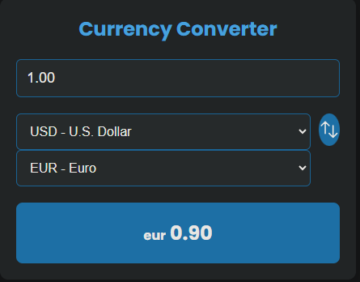

# Live Currency Conversion Web Application


A simple and clever currency converter web application.

## Overview

This project implements a currency converter that allows users to convert between different currencies. It provides a clean and intuitive user interface, along with real-time exchange rate data fetched from [floatrates.com](http://www.floatrates.com).

## Features

- Convert between various currencies.
- Real-time exchange rate data.
- Dark-themed and visually appealing design.

## Screenshots




## Getting Started

1. Clone the repository:

    ```bash
   https://github.com/Senaye2003/Live-Currency-Conversion-Chrome-Extension-.git
   cd currency-converter
    ```

2. Open `index.html` in your preferred web browser.

3. Explore and enjoy the currency converter!

## How to Use

1. Enter the amount you want to convert in the input field.
2. Select the source and target currencies.
3. View the converted result and exchange rate.
4. Optionally, use the swap button to quickly switch currencies.

## Dependencies

- [Poppins](https://fonts.google.com/specimen/Poppins) font from Google Fonts.

## Contributing

Contributions are welcome! Feel free to open issues and pull requests.

## License

This project is licensed under the [MIT License](LICENSE).

---

